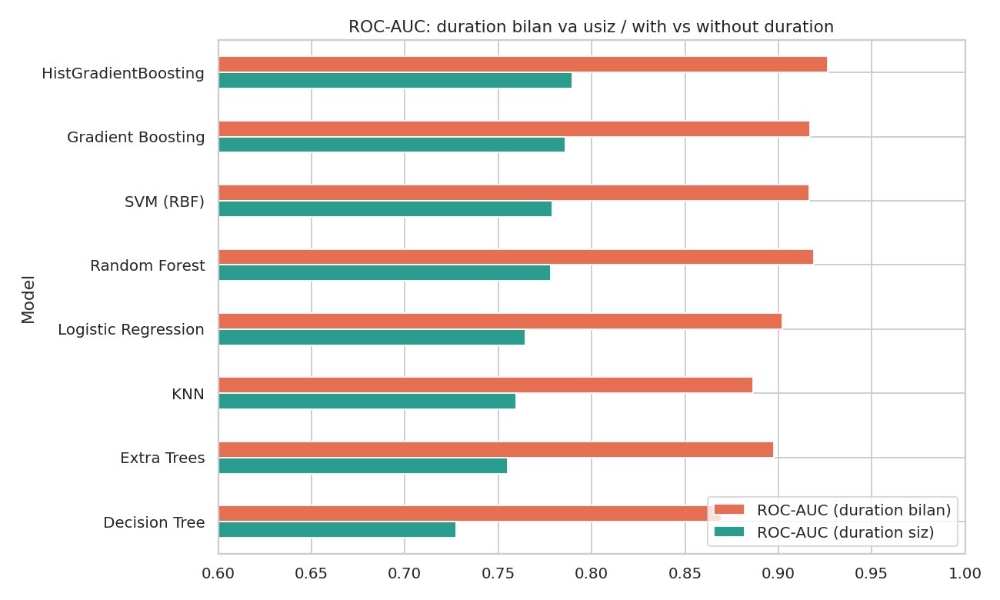
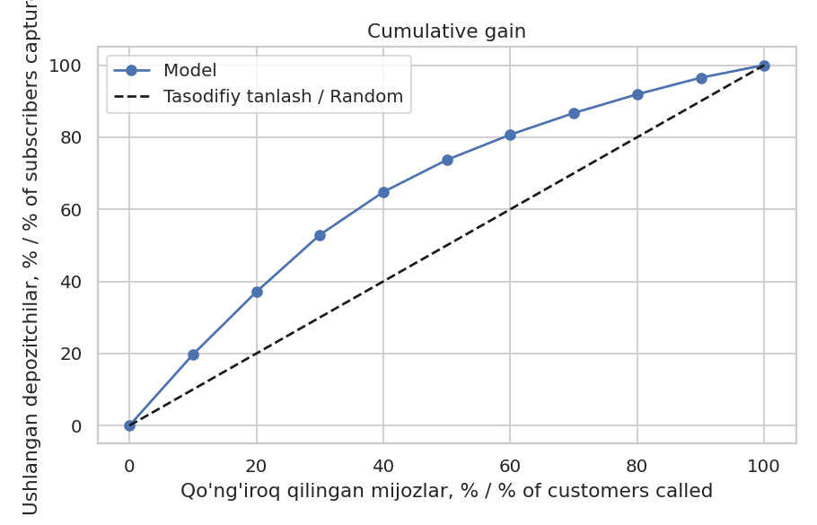

# 🏦 Predictive Banking Analytics: Term Deposit Prediction

Bank marketing kampaniyasida **qaysi mijozga qo'ng'iroq qilish kerakligini** oldindan bashorat qiluvchi ML loyihasi.
*A machine learning project that predicts which bank customers are worth calling for a term deposit offer.*

## 🔍 Nima o'zgardi? / What I improved

Birinchi versiyam: Random Forest + `LabelEncoder`, accuracy **85.27%**. Qayta ko'rib chiqqanda quyidagilarni aniqladim va tuzatdim:

| Muammo | Yechim |
|---|---|
| `duration` ustuni qo'ng'iroqdan *keyin* ma'lum bo'ladi (**target leakage**) | Modeldan olib tashlandi |
| `LabelEncoder` nominal ustunlarga soxta tartib beradi | `OneHotEncoder` + `Pipeline` |
| Bitta model, tekshiruv yo'q | 8 ta algoritm, 5-fold stratified CV |
| Faqat accuracy | Accuracy, F1, ROC-AUC, confusion matrix, gain/lift |
| Sozlash yo'q | `RandomizedSearchCV` |
| Impurity-based importance (biased) | Permutation importance |

## 📊 Natijalar / Results

**Algoritmlar taqqoslash** (5-fold CV, train to'plami, `duration`siz):

| Model | Accuracy | F1 | ROC-AUC |
|---|---|---|---|
| HistGradientBoosting | 0.735 | 0.692 | 0.790 ± 0.007 |
| Gradient Boosting | 0.734 | 0.685 | 0.786 ± 0.006 |
| SVM (RBF) | 0.730 | 0.671 | 0.779 ± 0.007 |
| Random Forest | 0.727 | 0.692 | 0.778 ± 0.004 |
| Logistic Regression | 0.706 | 0.655 | 0.765 ± 0.006 |
| KNN | 0.707 | 0.655 | 0.759 ± 0.008 |
| Extra Trees | 0.701 | 0.668 | 0.755 ± 0.006 |
| Decision Tree | 0.674 | 0.606 | 0.727 ± 0.009 |



**Yakuniy model:** tuned **HistGradientBoosting**

| | Accuracy | ROC-AUC |
|---|---|---|
| Avvalgi yondashuv (leakage bilan) | 0.8527 | 0.9155 |
| **Yangi model (duration siz, test)** | **0.7470** | **0.7952** |

> Yangi accuracy past ko'rinadi, lekin bu **halol** natija: avvalgi 85% qo'ng'iroq tugagandan keyingina ma'lum bo'ladigan ma'lumotga tayangan edi.

**Biznes ma'nosi:** modelning eng yuqori ball bergan 30% mijozlariga qo'ng'iroq qilsak, depozit ochadiganlarning taxminan **52.9%** ini ushlaymiz (tasodifiy tanlashda 30%). 50% mijozga qo'ng'iroq qilsak, **73.7%**.



## 📁 Tuzilma / Structure
```
├── bank.csv
├── predictive_banking_analytics_improved.ipynb
├── bank_deposit_model.joblib
├── results.json
├── requirements.txt
└── images/
```

## ▶️ Ishga tushirish / Run
```bash
pip install -r requirements.txt
jupyter notebook predictive_banking_analytics_improved.ipynb
```

## ⚠️ Cheklovlar / Limitations
- `month`/`day` kampaniya vaqti signali bo'lib, mijoz xususiyati emas; real tizimda vaqt bo'yicha validatsiya kerak.
- Bitta bank va bitta davr ma'lumoti, boshqa bozorga o'tkazishda qayta o'qitish kerak.
- Keyingi qadamlar: narx-foyda asosida threshold tanlash, SHAP tushuntirishlari.
